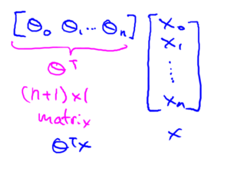
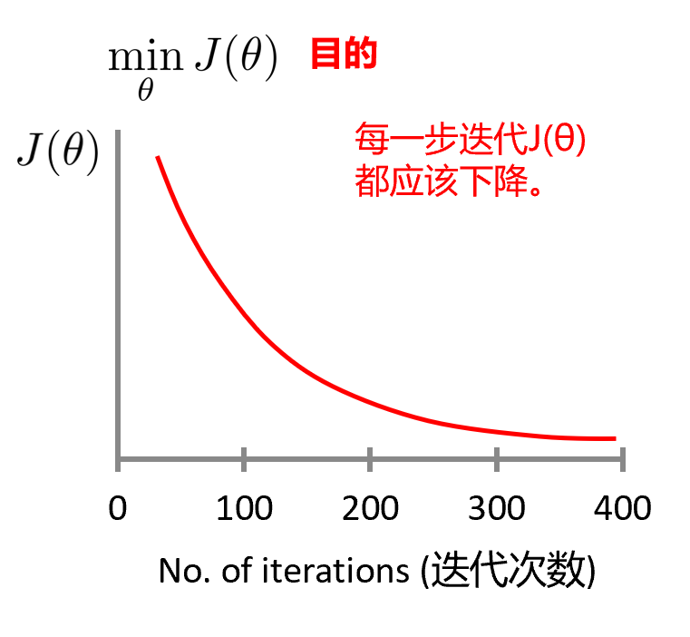
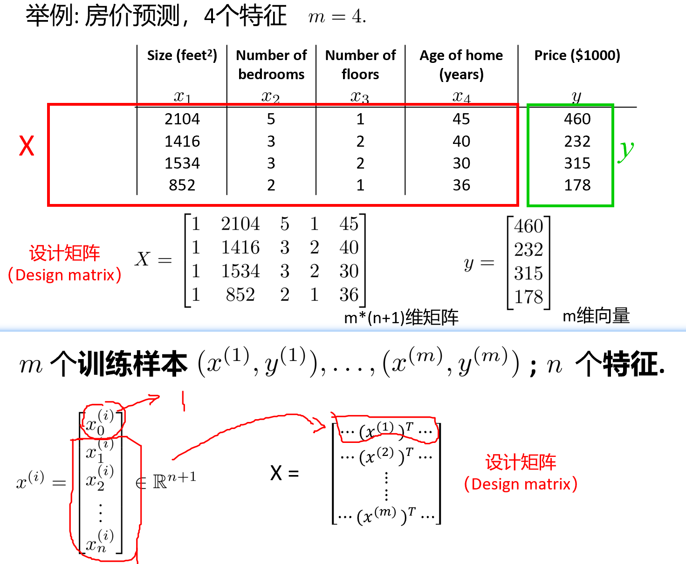
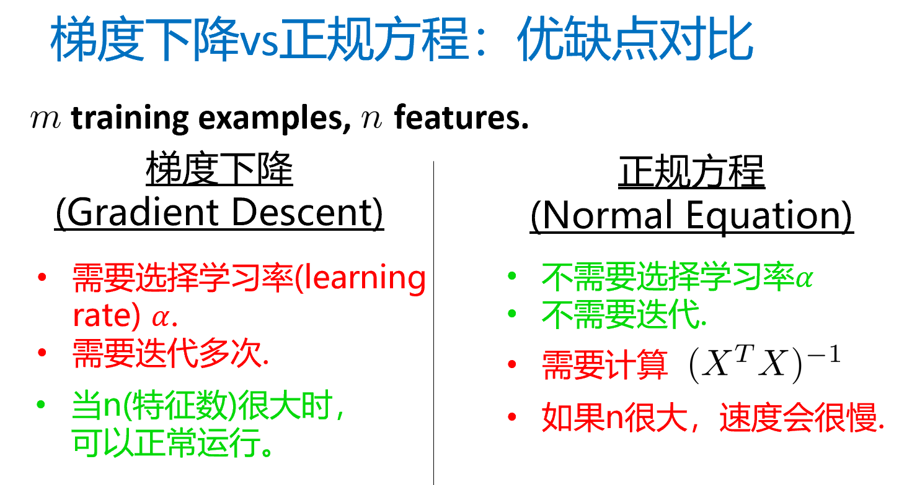

## 一、numpy 矩阵操作

默认 列向量n \* 1

大写字母 表示矩阵
小写字母 表示数值或向量(加粗)

1-索引 MATLAB等数学类
0-索引

### 1. 创建向量
```python
 import numpy as np
 # 行向量
 vector = np.array([4, 5, 6, 7])
 # 列向量
 vector = np.array([[4], [5], [6], [7]])
```

### 2. 创建矩阵
```python
A = np.array([[4,12],
			  [13,8],
			  [9,14],
			  [11,23]])
# 获取指定元素
print(A[0,1]) # 获取第一行第二列的元素 12
```

### 3. 矩阵的四则运算
#### (1)加法
```python
# 对应位置直接相加
result = matrix1 + matrix2
```
 
#### (2)乘/除一个数
矩阵的每个数都乘除

### 4. 矩阵乘向量
```python
result = np.dot(matrix, vector)
```
注：==A\*B是对应位置直接乘 不是矩阵乘法==

For 循环效率低，线性回归模型采用矩阵相乘表示
预测值 = 数据矩阵 \* 参数向量
```python
house_sizes = np.array([[2104],
						[1416],
						[1212],
						[892]]) 
theta = np.array([[-40], 
				  [0.25]])
# 添加一列1
ones_column = np.ones((4,1)) #一列4*1的1
X = np.hstack((ones_column, house_sizes))
# 预测价格
predicted_prices = np.dot(X, theta)
```

### 5. 矩阵乘矩阵
**多个**不同的回归模型
参数矩阵 一列为一个模型的参数
得到的矩阵 一列为一个模型的预测值

满足结合律，不满足交换律

### 6. 单位矩阵 $I$ (Identity matrix)
正对角线值为1
```python
# 创建一个n*n的单位矩阵
identity_matrix = np.eye(4) #4*4
```

### 7. 矩阵求逆
$AA^{-1} = A^{-1}A = I$
**奇异矩阵:** 不可逆的矩阵

```python
# 求matrix的逆矩阵(linear algebra 线性代数，inverse "逆")
inverse_matrix = np.linalg.inv(matrix)
```

尝试求奇异矩阵的逆矩阵 报错 `LinAlgError: Singular matrix`

### 8. 矩阵转置
```python
# 求A矩阵的转置
A_transpose = A.T
```

### 9. 线性回归代价函数用线性代数表示
代价函数: $J(\theta_0, \theta_1) = \frac{1}{2m} \sum_{i=1}^m(h_\theta(x^{(i)})-y^{(i)})^2$
->
$J(\theta) = \frac{1}{2m} (X\theta-y)^T(X\theta-y)$


## 二、多变量的线型回归

### 1. 多特征变量

>**数学表示:**
	$n$ 特征数量
	$m$ 样本个数
	$x^{(i)}$ 第 $i$ 个训练样本的特征向量
	$x_j^{(i)}$ 第 $i$ 个训练样本的第 $j$ 个特征

多变量线性回归

$$
\begin{align*}
h_\theta(x) & = \theta_0x_0 + \theta_1x_1 + \theta_2x_2 + … + \theta_nx_n ,(x_0 = 1)\\
			& =\theta^Tx
\end{align*}
$$


### 2. 多变量梯度下降
$$
\theta_j = \theta_j - \alpha \frac{1}{m}\sum_{i=1}^m(h_\theta(x^{(i)})-y^{(i)}) x_j^{(i)}
$$

#### 实用技巧
**(1)特征缩放**
除最大值，使所有值都处于0-1之间

*归一化* ( 使每个特征的取值都大致为 \[-1,1] )
- Min-max 归一化 \[0,1]
$$x_i = \frac{x_i - min}{max - min}$$
- 均值标准差归一化 (特征归一化到0均值，1标准差)
$$
\begin{align*}
& x_i = \frac{x_i - \mu_i}{s_i}\\
& \mu_i:x_i的均值\\
& s_i:x_i的标准差
\end{align*}
$$

**(2)学习率**
从大往小试高次
选大的不至于崩掉的 慢慢减小

loss iter图像如果出现往上跳一下 -> 学习率太大了



### 3. 特征选择和多项式回归
创造新的有意义的特征

拟合不好的时候可以用高次方项
- 使用高次项仍然是线性回归
- 归一化！(1-100,1-10000,1-1000000)

### 4. 正规方程

**不需要归一化**
给出 $\theta$ 解析解
$$
\theta = (X^TX)^{-1}X^Ty
$$

对比


如果 $X^TX$ 不可逆
(1)冗余特征(线性相关)
(2)特征太多(e.g. m<n) 删除一些或者正则化